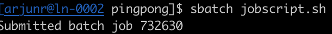

# Problem Statement

Determine the delay and bandwidth of the connection between two nodes with the help of an MPI program, using *MPI_Send* and *MPI_Recv*.

**Delay**

1. Send a number back and forth between two processes, allocating one process per node. Calculate the time it takes for these data transfers. 
2. Calculate the average time for say, 50, of these transfers and the respective average time for a one-way transmission (i.e., the network delay) in microseconds and print it to the console.

*Note*: The very first MPI communication could have a large overhead and should not be included in the average calculation.

**Bandwidth**

1. Instead of sending a single number, send a bigger chunk of data.
2. Calculate the average delay for sending this chunk and from that calculate the bandwidth. 
3. Output the bandwidth achieved in Gigabytes per second (GB/s) for a chunk size of 32MiB (Megabytes) to the console.

To verify your measurement results, refer to the slide 14 in the lecture [01 - Slides](https://panda.uni-paderborn.de/mod/resource/view.php?id=762347)

## Submission

### Files for submission
* `main.c`: Your solution 
* `Makefile`: Running `make` should output an executable named `main.out`. Please use either the gnu or the intel compiler given in the Cheatsheet. 
* `jobscript.sh`: Batch script used to schedule your job in Noctua 
*  Job script output: output from your scheduled job in Noctua
* `jobid.txt`: The jobid of your scheduled job in Noctua to verify that you executed your solution. 

*By submitting the slurm job id, you are giving consent to access data related to that specific job executed in Noctua. If you do not wish to agree to this, please send a mail to arjun.ramaswami@uni-paderborn.de.*

### Output

- `main.c` file: The printf statements for the relevant output are already given in the file. Please do not modify them. Note the units of the metrics for the correct answer:
  * Delay for a one-way transmission in *microseconds*
  * Output bandwidth for chunk size *32MiB (Megabytes)*

*Note*: Make sure that only one process prints the answers and not all the processes.

- `jobid.txt`: job id of the slurm job of your final execution in Noctua before submitting the code for evaluation. For example:

## Submitting your Solution
- Create a new branch called **Submission**
    - Case sensitive!
- Only your final commit in the **Submission** branch is taken into account for evaluation. 
- The master branch is protected so you cannot push to it.

**Note**: Be aware that your submission is checked for plagiarism from solutions of other candidates and others. If found guilty, you will be asked to prepare for a one on one interview. 

## Helpful Slurm Job Script Commands

* `--nodes=<num_nodes>` to specify the number of nodes needed
* `--ntasks-per-node=<ntasks>` to specify the number of tasks to be invoked per node.

Note: Use `mpirun` or `mpiexec` in your jobscript to launch your program with the required number of concurrent processes.

[Link](https://slurm.schedmd.com/sbatch.html) for further information.

